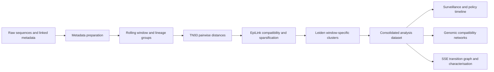

# Scotland SARS-CoV-2 Genomic Surveillance and Network Analysis

This repository implements a national SARS-CoV-2 genomic-surveillance workflow for Scotland, from linked sequence metadata and temporal-genetic compatibility through window-specific clustering, descriptive surveillance, compatibility-network analysis, superspreading-compatible candidate detection, and Bayesian characterisation.

The analysis treats EpiLink edges and cluster transitions as genome-informed compatibility and continuity signals, not directly observed transmission events. Chapter-level documentation defines the interpretation limits for each analytical layer.

## Project workflow



## Repository structure

- `config.yaml`: central raw/processed data paths and pipeline parameters.
- `method/`: preprocessing, rolling-window construction, TN93 command generation, pairwise dataset construction, EpiLink/Leiden clustering, consolidation, and scheduling utilities.
- `utils/`: shared data loaders, policy-period/OxCGRT helpers, plotting style, and figure-writing utilities.
- `chapter_analyses/`: importable thesis-analysis namespace containing surveillance, genomic-network, and SSE packages.
- `chapter_analyses/surveillance/`: policy indices, daily sequence surveillance, lineage replacement, overtakes, and sequencing coverage.
- `chapter_analyses/genomic_networks/`: cohort summaries, window-specific clusters, compatibility mixing/assortativity, topology, pairwise distances, vaccination context, SIMD validation, and sensitivity analyses.
- `chapter_analyses/sse_detection/`: temporal cluster transitions, upstream novelty, burst and burden detection, candidate tiers, figures/tables, and Bayesian characterisation.
- `data/`: raw and processed inputs and intermediate analysis datasets; excluded from version control.
- `assets/`: project diagrams, maps, timelines, and writing/reference materials. Reproducible rolling-window and EpiLink method schematics, with SVG/PNG build commands, are documented in the [method pipeline](method/PIPELINE.md#regenerating-the-method-schematics).

## Documentation map

- [Method pipeline](method/PIPELINE.md): complete preprocessing and clustering execution contract.
- [Chapter analyses](chapter_analyses/README.md): overview and main entry points for the three analysis packages.
- [Surveillance README](chapter_analyses/surveillance/README.md) and [technical reference](chapter_analyses/surveillance/TECHNICAL.md).
- [Genomic networks README](chapter_analyses/genomic_networks/README.md) and [technical reference](chapter_analyses/genomic_networks/TECHNICAL.md).
- [SSE detection README](chapter_analyses/sse_detection/README.md), [technical reference](chapter_analyses/sse_detection/TECHNICAL.md), [detection rationale](chapter_analyses/sse_detection/DETECTION_RATIONALE.md), and [Bayesian model reference](chapter_analyses/sse_detection/BAYESIAN_MODELS.md).

## Environment

The Python dependencies are listed in `requirements.txt`. Create and activate an isolated environment, then install them:

```bash
python -m pip install -r requirements.txt
```

The method pipeline also requires command-line installations of `samtools`, `tn93`, and GNU parallel. Bayesian SSE fitting additionally requires the Bambi/PyMC/ArviZ stack used by the project environment.

Run all commands from the repository root so `config.yaml`, `utils`, and `chapter_analyses` resolve consistently.

## Configuration and default analysis parameters

`config.yaml` is the authoritative path and method configuration. Current principal defaults are:

| Parameter | Default |
| --- | ---: |
| Rolling-window size | 3 weeks |
| Rolling-window step | 1 week |
| Minimum window-lineage group size | 2 sequences |
| Alignment length | 29,903 bases |
| Leiden resolution sweep | 0.1–0.8 |
| Main Chapter 4 Leiden resolution | 0.3 |
| EpiLink sparsification threshold | 0.001 |
| Random seed | 42 |

Do not embed machine-specific data locations in analysis scripts; add or update them in `config.yaml`.

## Method pipeline

The pipeline must be executed in dependency order:

```bash
python3 method/01_prep_metadata.py
python3 method/02_gen_tn93_commands.py
./method/parallel_run.sh -c data/processed/group_fastas/tn93_commands.txt
python3 method/03_build_pairwise_dataset.py
python3 method/04_gen_cluster_commands.py
./method/parallel_run.sh -c data/processed/cluster_commands.txt
python3 method/05_consolidate.py
python3 method/build_sparsified_edge_manifest.py
```

The generated command-file paths above reflect the current `config.yaml`; consult `method/PIPELINE.md` before running the full workflow. TN93 jobs must finish before pairwise-dataset construction, and clustering jobs must finish before consolidation.

The final shared analysis input is:

```text
data/processed/scotland_clustering_analysis_dataset.parquet
```

## Chapter analyses

### Surveillance and policy indices

```bash
python -m chapter_analyses.surveillance.policy_sequences_over_time
python -m chapter_analyses.surveillance.policy_index_comparison
```

The policy-index comparison reads Scotland's OxCGRT Stringency and Containment and Health indices directly from `data/raw/oxcgrt/` and writes the daily alignment, correlation summary, and two-panel validation figure.

### Genomic surveillance and compatibility networks

Build the core Chapter 4 tables:

```bash
python -m chapter_analyses.genomic_networks.build_cluster_tables
```

Build all compatibility-network mixing and assortativity outputs, including separately scheduled giant pairwise files:

```bash
python -m chapter_analyses.genomic_networks.build_mixing --all-windows --workers 4 --include-giants --giant-workers 1
```

Build supplementary distance, sensitivity, SIMD, figure, and LaTeX-table outputs:

```bash
python -m chapter_analyses.genomic_networks.build_cluster_pairwise_distance_summary --all-windows
python -m chapter_analyses.genomic_networks.build_sensitivity_tables
python -m chapter_analyses.genomic_networks.build_simd_validation
python -m chapter_analyses.genomic_networks.make_figures --skip-missing
```

### Superspreading-compatible signal detection

Build transition-graph features, burst/burden scores, calibration, and candidate tiers:

```bash
python -m chapter_analyses.sse_detection.lib.sse.detection
```

Build composition tables and regenerate saved-result figures/tables:

```bash
python -m chapter_analyses.sse_detection.build_composition_tables
python -m chapter_analyses.sse_detection.make_figures --skip-missing
```

Bayesian dry runs, fitting commands, priors, diagnostics, and output contracts are documented in `chapter_analyses/sse_detection/BAYESIAN_MODELS.md`.

## Output layout

- `data/processed/`: reusable method-stage parquets, FASTA groups, pairwise files, cluster assignments, manifests, and the consolidated analysis dataset.
- `chapter_analyses/surveillance/results/`: surveillance tables and policy/lineage figures.
- `chapter_analyses/genomic_networks/results/`: Chapter 4 tables, intermediate compatibility chunks, figures, and LaTeX fragments.
- `chapter_analyses/sse_detection/results/`: detector tables, transition summaries, composition tables, figures, and Bayesian outputs.

Data, figures, tables, results, caches, and local IDE configuration are excluded through `.gitignore`. Reproducible code and documentation should remain version controlled; generated outputs should be rebuilt from the declared inputs and configuration.

## Data governance and disclosure

Raw PHS-linked inputs include confidential health data and must remain in approved storage. Do not commit raw or processed person-level data, local paths, credentials, or disclosive outputs.

Publication-facing summaries must be checked against the active PHS disclosure rules. Chapter 4 composition tables include small-cell flags, but these flags do not replace formal disclosure review.

## Reproducibility checklist

1. Record the Git revision, environment, `config.yaml`, raw-data versions, and external tool versions.
2. Run the method stages in order and retain logs/job records for the TN93 and clustering batches.
3. Record QC filters, resolution, sparsification threshold, window selection, random seeds, and any development caps.
4. Do not mix intermediate compatibility chunks produced under different configurations.
5. Rebuild downstream chapter outputs after changing cluster, transition, detector, or policy definitions.
6. Inspect calibration, sensitivity, uncertainty, missingness, censoring, and disclosure diagnostics before reporting results.
