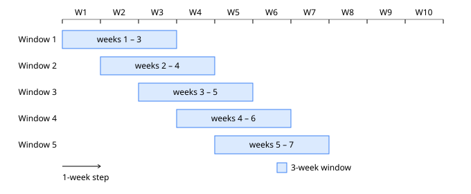
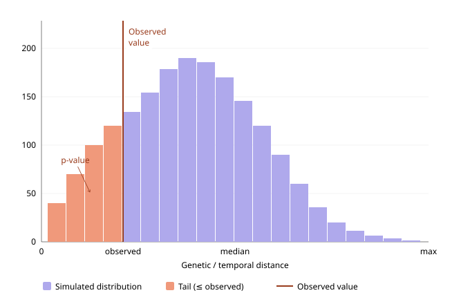

# Scotland SARS-CoV-2 Clustering Pipeline

The method pipeline prepares linked metadata, groups sequences by overlapping time window and Pango lineage, computes TN93 distances, scores EpiLink compatibility, applies Leiden clustering, and consolidates the results.

All configured paths are relative to the repository root unless absolute. Run commands from that root.

## Execution

```bash
python3 method/01_prep_metadata.py
python3 method/02_gen_tn93_commands.py
./method/parallel_run.sh -c data/processed/group_fastas/tn93_commands.txt
python3 method/03_build_pairwise_dataset.py
python3 method/04_gen_cluster_commands.py
./method/parallel_run.sh -c data/processed/cluster_commands.txt
python3 method/05_consolidate.py
```

TN93 jobs must finish before stage 03; clustering jobs must finish before stage 05. Keep `data.processed.group_fasta_dir` through clustering because its `.ids` files retain sequences with no edge above the sparsification threshold.

Most Python stages accept `--config`, `--root`, and `--log-level`; inspect `--help` for stage-specific filters and overrides.

## Configuration

`config.yaml` has three sections:

- `pipeline`: window width/step, minimum group size, alignment length, Leiden resolutions, seed, and sparsification threshold;
- `tn93`: TN93 distance threshold, ambiguous-site mode, and quiet flag;
- `data.raw` and `data.processed`: input and output paths.

The current defaults are 3-week half-open windows stepped weekly, minimum group size 2, alignment length 29,903, Leiden resolutions 0.1–0.8, seed 42, and sparsification `epilink_compatibility > 0.001`.

## Stage contracts

### 01: metadata preparation

`01_prep_metadata.py` reads PHS sequence, testing, vaccination, and health-board files; Nextclade annotations; SIMD; and the Data Zone shapefile. It writes six parquets:

| Config key | Content |
| --- | --- |
| `metadata` | One row per retained sequenced specimen with lineage/QC, demographics, coordinates, test attributes, reinfection flag, and latest dose on or before collection |
| `testing` | Daily Data Zone test counts |
| `vaccination` | Daily Data Zone vaccination-event summaries |
| `simd` | Data Zone SIMD and administrative attributes |
| `geography` | Data Zone geometry, centroid, area, and SIMD attributes |
| `hb_trends` | Daily Health Board case, hospital, ICU, reinfection, and testing metrics |

Age bands are converted to midpoints. SIMD rows containing a null in any retained field are dropped with a warning. Required sequence-modelling fields are complete-case filtered. The reinfection flag uses a 90-day gap from the preceding positive test.

### 02: TN93 command generation

`02_gen_tn93_commands.py` deduplicates metadata by `sequence_id`, creates half-open windows (`start <= collection_date < end`), and partitions each window by Pango lineage. Groups smaller than `pipeline.min_group_size` are skipped.

For each retained group it writes `group_fastas/<stem>.ids` and adds a compound `samtools faidx && tn93` command to `tn93_commands_file`. Output stems have the form `W042_BA.2_317`. A sequence can occur in up to three windows with the default width and step.



### Batch runner

`parallel_run.sh` executes one command per line with GNU parallel:

```bash
./method/parallel_run.sh -c COMMANDS_FILE [-j N] [--retries N] [--timeout SECS]
  [--joblog FILE] [--resume-failed] [--tmpdir DIR] [--no-compress]
  [--progress] [--dry-run]
```

The default worker count is the detected CPU count. The default joblog is beside the command file. Job buffers use `--tmpdir`, then `$TMPDIR`, `/var/tmp`, `/tmp`, or a `.parallel-tmp` directory beside the joblog.

### 03: pairwise dataset

`03_build_pairwise_dataset.py` processes every matching TN93 CSV:

1. remove invalid/self pairs and deduplicate undirected endpoints;
2. calculate `snp_distance = round(tn93_distance * alignment_length)`;
3. calculate absolute sampling-date difference in days;
4. calculate EpiLink compatibility;
5. write one Zstd-compressed parquet per group.

The schema is:

```text
window_id, pango_lineage, nunique_sequences, id1, id2,
tn93_distance, snp_distance, temporal_distance, epilink_compatibility
```

Existing parquets are skipped unless `--force` is used. An EpiLink exception is logged and produces missing compatibility values for that group rather than aborting the stage.

### EpiLink wrapper

`epilink_wrapper.py` creates one EpiLink instance per process. Its fixed parameters include a 29,903-base genome, stochastic mutation process, maximum depth 0, targets `ad(0)` and `ca(0,0)`, 10,000 Monte Carlo samples, and RNG seed 42.

The EpiLink genome length must match `pipeline.alignment_length`. The EpiLink seed is a code constant (`RNG_SEED`), not read from `config.yaml`.



Regenerate both method schematics with:

```bash
conda run -n PhD python assets/build_sliding_3week_windows.py
conda run -n PhD python assets/build_observed_vs_null_distance.py
```

Both builders write SVG and 2× PNG files by default; use `--help` for output overrides.

### 04 and clustering: Leiden assignments

`04_gen_cluster_commands.py` creates one `cluster_pairwise.py` command per pairwise parquet and forwards the configured resolutions, seed, sparsification threshold, and matching `.ids` path. `--include` and `--exclude` restrict stems.

`cluster_pairwise.py`:

1. reads edges whose compatibility is strictly above the threshold;
2. deduplicates undirected pairs;
3. adds endpoint-free nodes from `.ids`;
4. runs weighted Leiden for every configured resolution with 10 iterations;
5. writes one row per sequence and resolution: `sequence_id`, `window_id`, `resolution`, `cluster_id`.

If no edge survives, every known sequence becomes a singleton. If `.ids` is absent, membership is inferred from all pairwise endpoints before thresholding; truly endpoint-free sequences cannot then be recovered.

### 05: consolidation

`05_consolidate.py` concatenates cluster parquets, adds size-one lineage/window groups skipped by TN93, and joins processed sequence, SIMD, testing, vaccination, and Health Board data. It writes `data.processed.analysis_dataset`.

Important derived fields include theoretical window dates; cluster size, duration, and Data Zone count; same-day and 7-row testing positivity; cumulative Data Zone sequence/test counts; cumulative vaccination-event count divided by population; incidence; and the latest Health Board report on or before collection. The vaccination quantity counts recorded dose events, not unique vaccinated residents. Patient IDs are replaced by run-specific `P000001`-style labels.

The SIMD join is inner and can remove sequences whose Data Zones are absent after SIMD cleaning. Health Board trends are skipped with a warning if the SIMD input lacks `HBcode`.

## Optional sparse-edge manifest

Chapter 4 uses an edge-count manifest to schedule very large pairwise files:

```bash
python3 method/build_sparsified_edge_manifest.py
```

It scans `epilink_compatibility` in batches, counts rows strictly above the configured threshold, and writes parquet plus CSV at `data.processed.sparsified_edge_manifest`. This is a downstream scheduling artifact, not a prerequisite for method consolidation.

## Dependencies and reproducibility

Python dependencies are in `requirements.txt`; external executables are `samtools`, `tn93`, and GNU parallel.

Record `config.yaml`, raw inputs, software versions, and batch joblogs. Leiden uses `pipeline.seed`; EpiLink uses its separate fixed seed. Changing alignment length, grouping, thresholds, resolution, or either seed requires rebuilding affected intermediate and downstream outputs. Do not mix same-stem chunks created under different settings.
