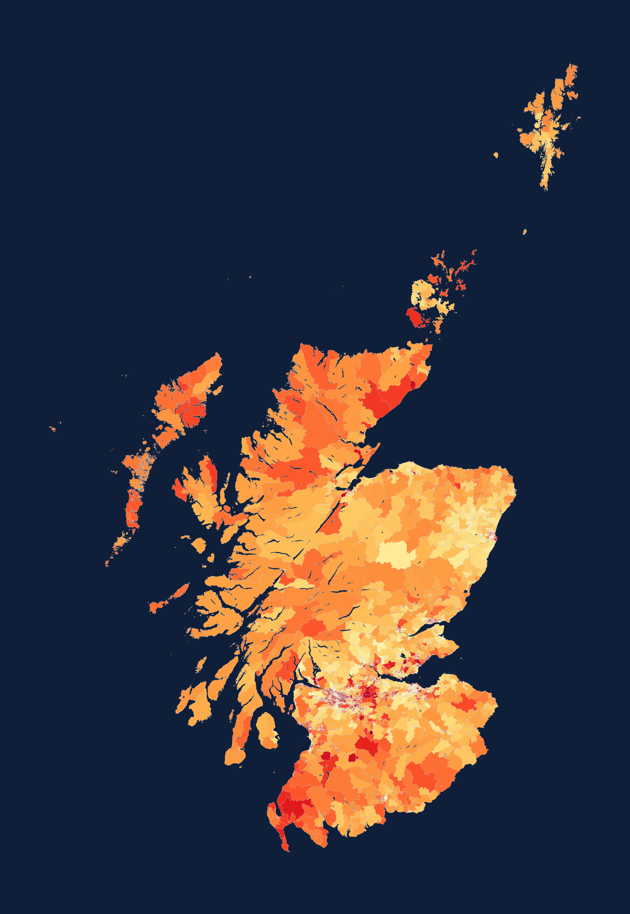
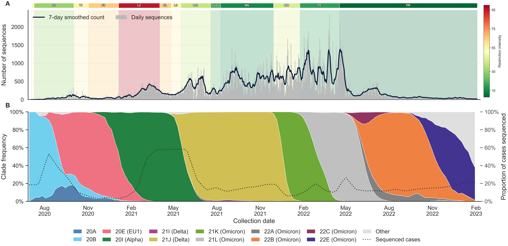
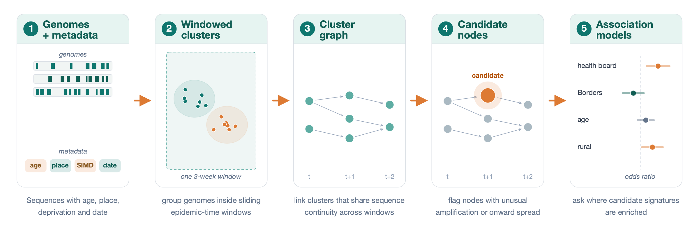
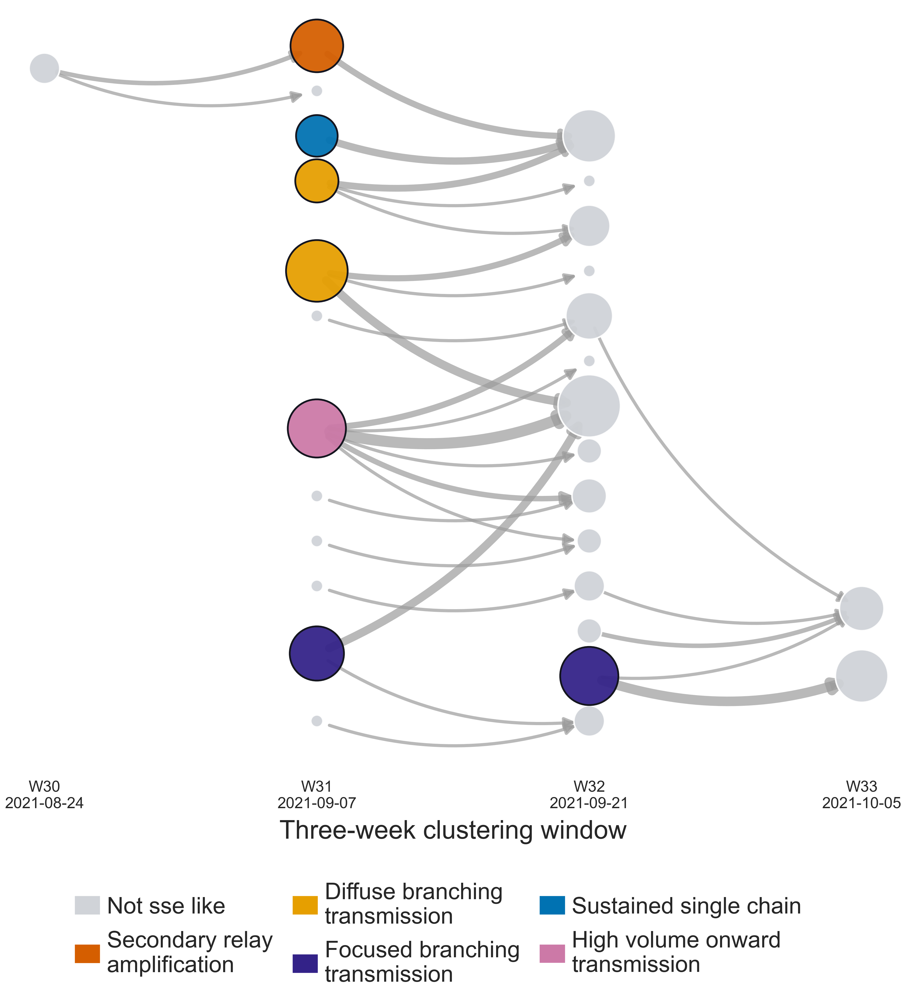
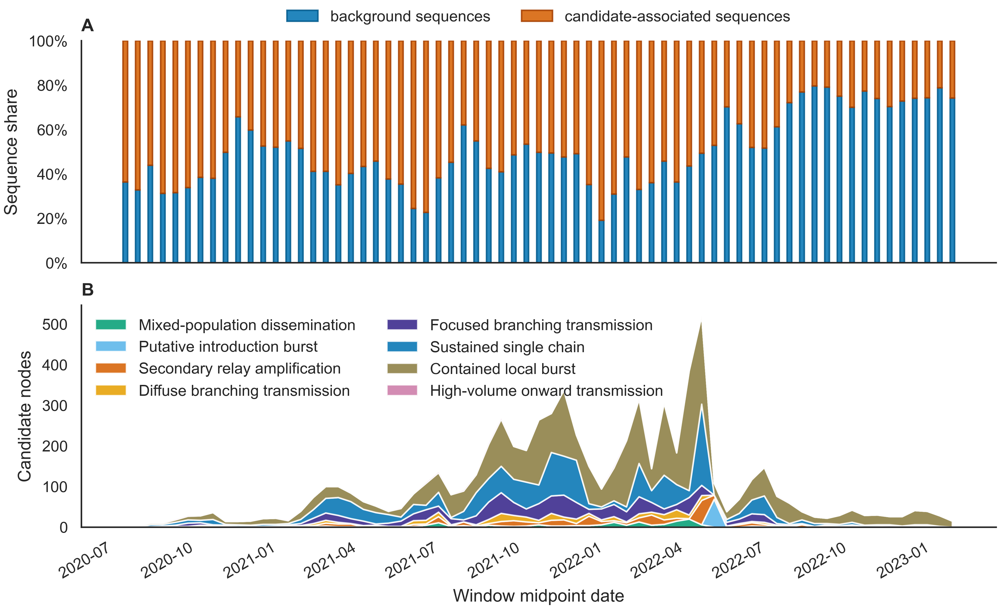
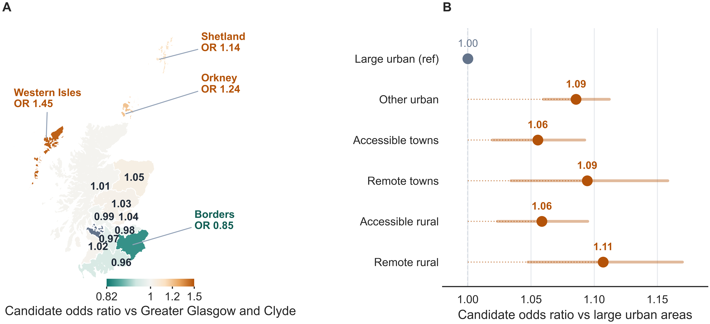
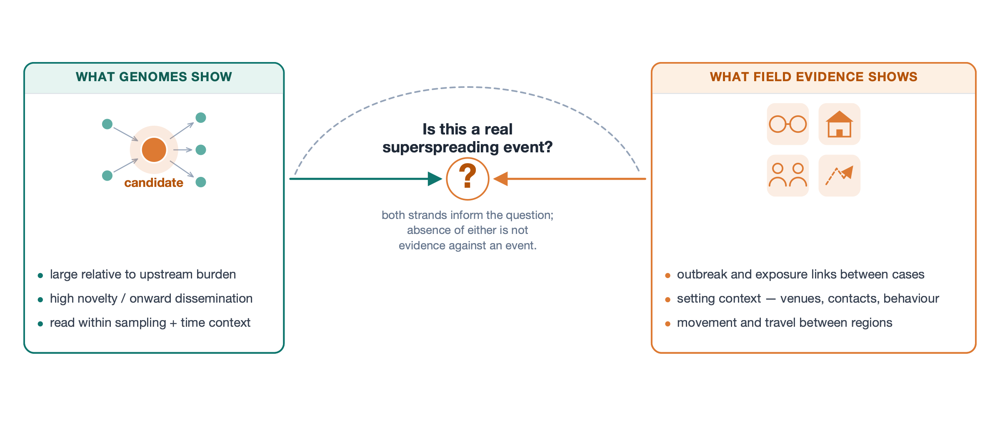

<!-- _class: title -->
<!-- _paginate: false -->

# Identifying Genomic Signatures of SARS-CoV-2 Superspreading Events in Scotland

## Roslin Internal Seminar

Dominic Arthur 
PhD student, Kao Group 
The Roslin Institute, University of Edinburgh 
<b>Supervisors:</b> Prof Rowland R. Kao & Dr Christopher J. Banks

  

  
  <!--  -->
  

28 May 2026

<!--
Speaker notes:
- Good afternoon everyone. I am Dominic, a final-year PhD student in the Kao Group.
- Over the next 20 minutes, I will talk through work asking whether Scotland's COVID-19 genome data can help identify genomic signatures of superspreading.
- By superspreading, I mean situations where one person, one setting, or one local network contributes a disproportionate amount of onward transmission.
- These events shaped the COVID-19 pandemic, but they are difficult to identify directly from genome data alone.
- The central challenge is resolution: SARS-CoV-2 has relatively low genetic diversity over short time scales, so the question is not whether genomes can prove an event occurred, but whether they can flag patterns worth investigating.
-->

---

## Research Group

# The Kao group studies how population structure shapes epidemics

  

    <h3>What we study</h3>
    
How contact patterns, movement, geography, and host populations change the way infections spread.

    
Applications include human pathogens such as SARS-CoV-2 and influenza, and livestock diseases such as foot-and-mouth disease and bovine TB.

  

  

    <h3>How we study it</h3>
    
Contact and movement networks, pathogen genomes, spatial data, and statistical or mechanistic transmission models.

    
My project sits in the genomic epidemiology part of that toolkit.

  

> Collaboration fit: structured contact data, pathogen genomes, surveillance modelling, and spatial epidemiology.

<!--
Speaker notes:
- To place the project in context, the Kao Group studies how population structure shapes disease spread.
- Population structure means the patterns that determine who can infect whom: contacts between people, animal movements between farms, geography, and how connected communities are over time.
- The group works across human and animal pathogens, including SARS-CoV-2, influenza, foot-and-mouth disease, and bovine TB.
- The biology differs, but the core questions often overlap: how does structure change transmission, and how can surveillance data reveal that structure?
- My project sits in the genomic epidemiology part of that toolkit, using virus genomes as one source of evidence about how transmission unfolded.
- If your work connects to contact data, movement records, pathogen sequences, spatial epidemiology, or surveillance modelling, I would be very happy to talk afterwards.
-->

---

## Big question

# What can virus genomes tell us about superspreading?

  

    <h3>What we can infer</h3>
    
Closely related genomes sampled close in time point to recent transmission.

    
Clusters that are unusually large, grow unusually fast, or seed onward clusters flag where intense transmission may have occurred.

  

  

    <h3>How we go about it</h3>
    
Build clusters from genetic and temporal proximity, then ask which are unusual relative to a null expectation set by sampling effort and epidemic context.

    
Treat the standouts as candidates for review.

  

> Genomes flag where to look. Confirming the setting still needs epidemiological evidence — exposure links, outbreak reports, or contact tracing.

<!--
Speaker notes:
- The main question is what virus genomes can tell us about superspreading, and where that inference stops.
- A confirmed superspreading event requires epidemiological evidence: a setting, exposure links, and ideally supporting outbreak or contact tracing data.
- I do not have those links directly, but I do have a very large set of virus genomes.
- Closely related genomes sampled close together in time point to recent transmission.
- Clusters that are unusually large, grow unusually quickly, or seed onward clusters are therefore useful signals to flag.
- The methodological challenge is making those flags rigorous: defining clusters, choosing an appropriate null comparison, and accounting for uneven sampling and changing epidemic context.
- I will use the word "candidate" deliberately throughout: it means a genomic signal worth reviewing, not a confirmed superspreading event.
-->

---
<!-- _class: figure -->

<!-- ## Genomic epidemiology of SARS-CoV-2 in Scotland -->

# 350,000+ genomes, linked to who, where, and when

  

SARS-CoV-2 genomic surveillance in Scotland, 2020–2023. (A) Daily sequence counts (grey bars) with 7-day smoothed mean (line); coloured bands mark restriction regimes, shaded by intensity (right colour bar). (B) Clade frequency over time (stacked areas, Nextstrain clades); the dotted line shows the proportion of confirmed cases sequenced (right axis). A mean of <strong>19.9%</strong> of cases were sequenced across the period, varying by <strong>15.4 percentage points</strong> between waves.

<!--
Speaker notes:
- This work uses a rich national surveillance resource from Public Health Scotland and COG-UK.
- Between 2020 and 2023, more than 350,000 Scottish SARS-CoV-2 genomes were generated, spanning the major variant waves and restriction regimes.
- The volume matters, but the linked metadata are just as important.
- Each sequence can be connected to collection date, geography, age, sex, area-level deprivation, and vaccination history.
- That allows the analysis to ask not only whether a cluster is unusual, but who is involved, where it appears, and what policy and variant context it sits within.
- The key caveat is that sequencing intensity changed through time, so any screen for unusual clusters must be calibrated against uneven sampling effort.
-->

---
<!-- _class: figure -->

# Pipeline clusters similar genomes, connect clusters through time, flag unusual bursts, and model associations

  

> <strong>Clusters</strong> are sets of genetically similar sequences sampled close in time, identified using a method we developed that needs no fixed genetic or duration thresholds.

<!--
Speaker notes:
- This is the methods slide I want people to remember.
- First, I split the epidemic into overlapping time windows and cluster together very similar genomes within each window.
- Second, I connect related clusters across neighbouring windows, so I can follow how a viral lineage appears to move through the sampled data.
- Third, I ask which clusters look unusual compared with other clusters observed at the same time.
- The important idea is simple: connect genome clusters through time, then look for unusual bursts in size, novelty, or onward spread.
-->

---

## Screening logic

# Three questions flag a cluster for review

  

    <h3>Is it large?</h3>
    
Does this cluster contain more sampled infections than its contemporaries in the same time window?

  

  

    <h3>Is it new?</h3>
    
What share of its sequences are newly observed, rather than carried over from an earlier cluster?

  

  

    <h3>Does it continue?</h3>
    
Does the cluster end, carry forward, or seed several later clusters?

  

> A **candidate** is a cluster that scores unusually on one or more of these questions — a review flag, not a confirmed event.

<!--
Speaker notes:
- The screen does not try to prove why a cluster grew.
- Instead, it asks three practical questions, each compared against clusters from the same time window.
- First: is it large? Does it contain more sampled infections than other clusters from the same period?
- Second: is it new? What share of its sequences are newly observed, rather than carried over from an earlier cluster?
- Third: does it continue? Does the signal end, carry forward, or seed several later clusters?
- Clusters need at least six sequences to enter the screen; below that, the comparisons are not reliable enough.
- A cluster that scores unusually on one or more of these questions becomes a candidate for review.
- Again, candidate means review flag, not confirmed event.
-->

---
<!-- _class: figure -->

## Example signal

# A candidate is a pattern through time, not a named event

  

    
  

  

    <h3>How to read it</h3> 
    <ul>
      <li>Columns are time windows</li> 
      <li>Circles are genome clusters</li> 
      <li>Bigger circles contain more sampled genomes</li> 
      <li>Arrows link genetically related clusters across windows</li> 
      <li>Coloured circles are flagged for review</li>
    </ul>
  

<!--
Speaker notes:
- This is what one flagged pattern looks like.
- The coloured circles are clusters flagged by the screen using the three questions from the previous slide.
- They may be unusually large, unusually new, or positioned where the lineage branches forward into several later clusters.
- The important point is what this figure is not: it is not a map of a known outbreak setting, and it is not a named event.
- It is the temporal shape of a viral lineage in sampled genome data.
- That is enough structure to say this part of the record deserves a closer look, but not enough to explain what happened on its own.
-->

---
<!-- _class: figure -->

## Result 1

# Varying proportion of sequences in candidate clusters

  

A timeline of flagged genomic patterns, not confirmed superspreading events.

<!--
Speaker notes:
- When the screen is applied across the full surveillance period, the flagged patterns are not evenly distributed through time.
- Some periods contain more unusual genome clusters than others, and the type of signal also changes.
- I would be cautious about over-interpreting individual peaks.
- Variant replacement, testing policy, sequencing intensity, and restrictions all affect what becomes visible in the genome data.
- The useful message is that the screen gives us a structured way to identify unusual parts of the epidemic record at national scale.
- The next step is to ask whether candidate membership is associated with socio-demographic or geographic factors.
-->

---
<!-- _class: figure -->

## Result 2

# What was happening on the Scottish Isles?

  

Candidate-node odds ratios by health board (A) and urban–rural class (B); island boards show the strongest enrichment.

<!--
Speaker notes:
- Here I am showing results from a logistic regression model.
- One model uses health board as the main predictor, and the other uses urban-rural class; both adjust for epidemic time windows, and clades.
- The strongest place signal appears in the Scottish islands.
- In Panel A, the odds ratios compare each health board with Greater Glasgow and Clyde, asking how much more or less likely sequences from that board are to sit in a flagged cluster.
- The island boards stand out most: Western Isles at 1.45, Orkney at 1.24, and Shetland at 1.14.
- Panel B shows a more modest urban-rural gradient, with remote rural areas and remote towns elevated by around 9-11% compared with large urban areas.
- So what was happening there? From these data alone, we cannot say.
- The signal could reflect true transmission dynamics in small, well-connected communities after an introduction.
- It could also reflect surveillance practice, introduction timing relative to local viral diversity, travel and connectivity patterns not captured in the model, or uncertainty from small island-board populations.
- This is exactly the kind of result the screen is designed to surface: a geographically specific, falsifiable question for external validation, not a conclusion by itself.
-->

---
<!-- _class: figure -->

# Findings need cautious interpretation

  

> Genomes prioritise where to look; epidemiology explains what happened.

<!--
Speaker notes:
- This is the conceptual point I want to leave you with.
- The genomic screen can scan years of surveillance data and produce a prioritised review list at national scale.
- That is something manual review cannot do consistently across hundreds of thousands of genomes.
- What the screen cannot do is confirm what happened or why.
- Confirmation requires evidence outside the genomes: setting information, outbreak investigations, contact tracing, and travel or mobility data.
- Genomics and epidemiology are complementary, not competing.
- The ideal workflow links them, with genomic flags triggering targeted epidemiological follow-up.
-->

---

## Conclusion

# A national-scale screen for candidates — and where it leads

  

    <h3>What this work shows</h3>
    <ul>
      <li><strong>Detectable signatures</strong> of unusual growth, novelty, and onward spread across 350,000 Scottish genomes.</li> 
      <li><strong>Structured by place</strong> — candidate membership is most consistently linked to health board, with island boards standing out compared to Glasgow.</li>
    </ul>
  

  

    <h3>Open questions</h3>
    <ul>
      <li>Can setting, mobility, or travel data confirm flagged signals?</li> 
      <li>How did restrictions, reopening, and testing changes shape what was visible?</li> 
      <li>Does vaccination alter candidate size, composition, or continuation?</li>
    </ul>
  

> A scalable, timely screen for candidates — not a replacement for epidemiological investigation.

<!--
Speaker notes:
- To bring it together, the main contribution is a scalable retrospective screen for candidate superspreading-like signatures in Scotland's pandemic genome data.
- The method clusters genomes across overlapping time windows and links those clusters into a transition graph.
- That makes it possible to identify nodes with unusual amplification, novelty, or onward spread at a scale manual review cannot match.
- The clearest population-level finding is that candidate membership is structured by place.
- The association is strongest and most consistent by health board, with island boards standing out, and more modest by urban-rural class.
- The open questions are where I would most welcome input.
- External validation is the biggest one: can setting, mobility, travel, or outbreak data confirm what the screen flags?
- The policy layer also matters, because restrictions and testing changes shaped which clusters were visible in the data.
- Vaccination effects on cluster composition and continuation are still largely unexplored in this framework.
- A final question is generalisability: could this approach transfer to influenza or other respiratory pathogens as genomic surveillance expands?
- If any of these questions overlap with your work, please come and talk to me.
-->

---
<!-- _class: title -->
<!-- _paginate: false -->

# Acknowledgements

## Thank you

Supervisors: Prof Rowland R. Kao and Dr Christopher J. Banks 
Kao Group, The Roslin Institute 
Public Health Scotland surveillance and data teams 
COG-UK consortium and Scottish sequencing contributors 
Wellcome Trust funding

  

  
  <!--  -->
  
  
  

<!--
Speaker notes:
- Thank you very much for listening.
- I am very grateful to Rowland Kao and Chris Banks for supervision and feedback.
- Thank you to the Kao Group for discussion around the network and modelling framing.
- Thank you also to Public Health Scotland and COG-UK for the surveillance data infrastructure, and to Wellcome for funding.
- I would especially welcome questions or conversations about validation, interpretation of the place signal, and whether similar approaches could be useful for other respiratory pathogens.
-->
